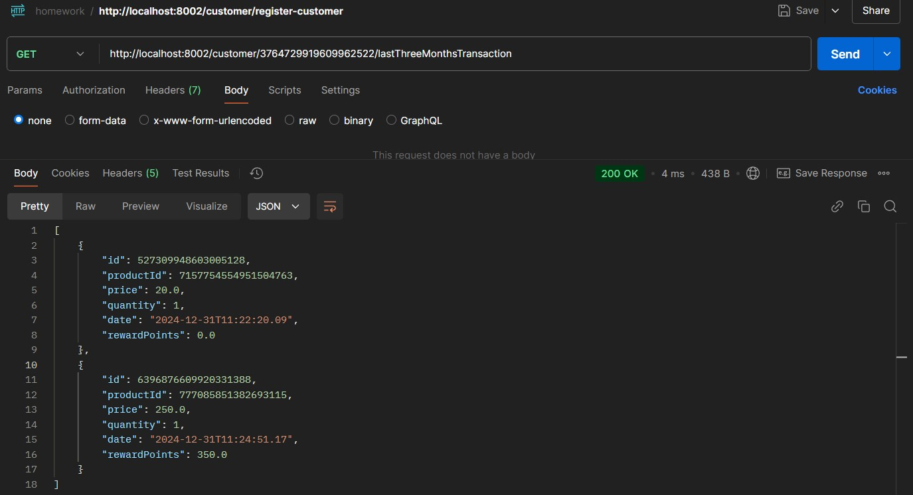

# homework-infosys

## Assignment Description
A retailer offers a rewards program to its customer, awarding points based on each recorded purchase. Customer receive 2 points on every burchase over $100, plus 1 point on every purchase between $50 and $100 for every transaction.

> Flow to start services
- start api-service
- start retailer-service
- start customer-service

## Eureka Server
> API gateway for Customer and Retailer Service
- http://localhost:8761/

## retailer - product - endpoints
> Endpoints screenshots
- All endpoints for Retailer service
 
- To add new product

- To get all products list

- To fetch product by product ID

- To reduce Quantity when customer purchase the product, used as proxy in customer service

- to open swagger url on port 8001, below is the link \
http://localhost:8001/swagger-ui/index.html

## customer
> Endpoints screenshots
- All endpoints for customer service

- To fetch all Customers

- To show all products, used proxy to fetch all products from retailer service

- To add new customer

- To buy product

- show products transaction by month

- show last 3 months transaction

- to open swagger url on port 8002, below is the link \
http://localhost:8002/swagger-ui/index.html
